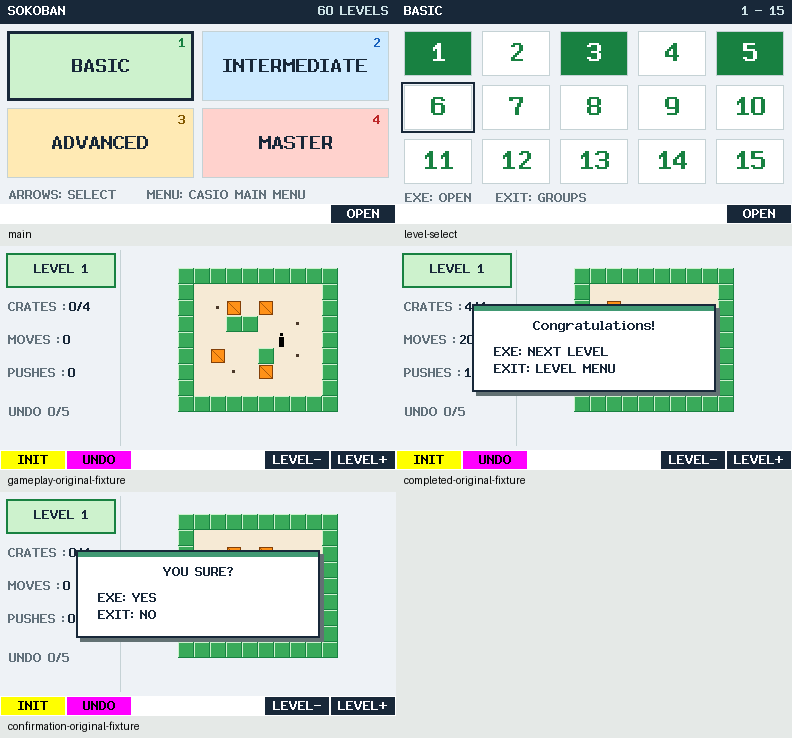

# SOKOBAN for CASIO fx-CG50


A native C / fxSDK / gint Sokoban add-in: four groups of 15 levels, five-step
undo, independent per-level automatic progress, and safe MENU / power-off
checkpoints. **v0.1.0-beta.1 — HARDWARE RETEST REQUIRED.** The owner reports
basic play working on an fx-CG50; the new navigation, layout, icon placement and
power-off paths still need physical testing.



These are actual shared-renderer host captures. Gameplay, confirmation and
completion illustrations use an independently authored MIT-licensed test map,
not one of the referenced upstream puzzles. They are not calculator photographs.

## Source-only prerelease

The [GitHub prerelease](https://github.com/omegalpha210/fx-cg50-sokoban/releases/tag/v0.1.0-beta.1)
publishes source and original illustration assets. **The upstream 60-map text,
generated map pack, map screenshots, and bundled `SOKOBAN.g3a` are not distributed.**
The maps are obtained from the referenced upstream source, but redistribution
status is not yet confirmed. Public GitHub availability is not a redistribution
grant. See [asset provenance](docs/ASSET_PROVENANCE.md).

The original game code is [MIT licensed](LICENSE). Third-party fonts, runtime
libraries and adapted DIFF EQ tools retain their [separate notices](THIRD_PARTY_NOTICES.md).
The MIT license does not apply to the upstream map pack.

## Build and install locally

Use an existing fxSDK 2.11 / gint 2.11 / SH GCC installation. Configure PATH or
`SOKOBAN_SDK_ROOT` and a Python 3 environment with Pillow; details are in
[DEVELOPMENT.md](docs/DEVELOPMENT.md). Then explicitly obtain pinned inputs:

```sh
python3 tools/fetch_maps.py
python3 tools/import_maps.py
bash tools/build.sh
bash tools/test.sh
```

The fetch command verifies immutable revision, byte sizes and SHA-256 hashes.
Ordinary builds never download or update maps. Obtaining files does not establish
permission to redistribute them or a resulting binary.

The local build creates `dist/SOKOBAN.g3a` and `dist/SHA256SUMS.txt`. Connect the
fx-CG50 in USB storage mode, copy the `.g3a` into storage memory, disconnect
safely, and select SOKOBAN from CASIO MAIN MENU. App identity is `@SOKOBAN`;
save files are `SOKO_A.dat` and `SOKO_B.dat`. DIFF EQ files are independent.

## Controls

| Key | Action |
| --- | --- |
| Arrows in menus | LEFT/RIGHT move to the previous/next number, across row ends and wrapping the entire page. UP/DOWN wrap in the same column. |
| 1–4 on Main | Open the corresponding group immediately. |
| EXE / F6 OPEN | Open the selected group or level. |
| Arrows in play | Move the player; push one crate. |
| F1 INIT | Restart the current level after EXE confirmation; EXIT cancels. |
| F2 UNDO | Undo up to five successful moves, including pushes. |
| F5 LEVEL- / F6 LEVEL+ | Checkpoint and open the adjacent global level; no 1↔60 wrap. |
| EXIT | From play, save and return to its level menu; then return to Main. Main EXIT stays there. |
| MENU | Save and return to the actual CASIO MAIN MENU. |
| SHIFT + AC/ON | Checkpoint dirty progress once, then power off through gint. A failed save does not trap power-off. |

BASIC 1–15, INTERMEDIATE 16–30, ADVANCED 31–45 and MASTER 46–60 are user-defined
groups, not an upstream difficulty ranking. All levels are available immediately.
Clear markers survive retries and INIT. Completion opens a small modal; EXE
advances globally, while EXIT opens the level grid. Both open the grid at level60.

Ordinary movement/undo changes RAM. Completion, INIT, play EXIT, level changes,
MENU and dirty power-off requests checkpoint progress. Each level retains its
own state and five undo records. Two slots preserve the last valid save through
failed writes. Forced power loss does not promise every uncheckpointed step.
A failed normal save offers retry/stay/continue without saving; OFF attempts once
and records failure in RAM before proceeding. See the [user guide](docs/USER_GUIDE.md).

## Validation and remaining checks

The engine, save-format version1 and map topology are unchanged by this UI update.
Host tests and UBSan, strict SH compile/link, package checks, whole-pack integrity,
mock native storage/power ordering, and shared-renderer audits are run locally.
The gameplay header's 24 pixels now expand the board viewport: 48 levels improve,
12 stay the same, and the minimum tile rises from8 to9 pixels.

Actual LCD legibility, OS-label spacing, physical SHIFT/AC behavior, real power
cycling and persistence must be retested. [Acceptance](docs/ACCEPTANCE.md) records
precise results and limits; [HARDWARE_RETEST.md](docs/HARDWARE_RETEST.md) is the
checklist. [한국어 설명](README_KO.md).
