# CASIO fx-CG50 소코반


C + fxSDK/gint 네이티브 애드인입니다. 60개 레벨, 최근 5회 UNDO, 레벨별 자동
저장과 SYSTEM 절전 설정을 지원합니다. **v0.1.0-beta.4**에서는 그룹별 플레이어
색과 완료한 보드 보기 기능을 추가했습니다.

## 실제 맵 화면

아래는 **실제 애플리케이션 렌더러와 원본 게임 맵**으로 만든 396×224 호스트
캡처입니다. 계산기 실물 촬영이나 CPU 에뮬레이터 화면은 아닙니다. 성공 화면은
1번 맵의 시작 상태에서 394회 정상 이동을 재생해 얻었습니다.
[캡처 방식과 출처](docs/screenshots/README.md)

| 메인 | BASIC 레벨 선택 · 1번 클리어 후 |
|---|---|
| 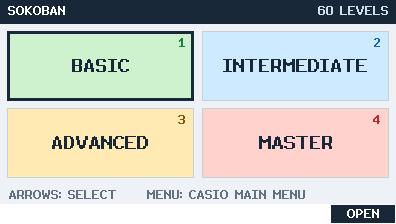 | 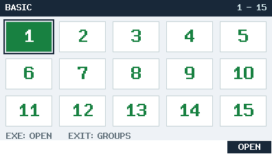 |

| BASIC · 1번 · 파랑 | INTERMEDIATE · 16번 · 분홍 |
|---|---|
| 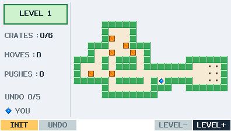 | 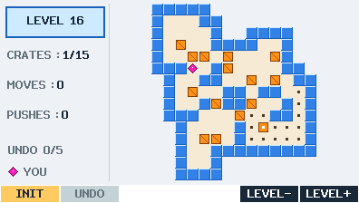 |
| **ADVANCED · 31번 · 보라** | **MASTER · 59번 · 민트** |
| 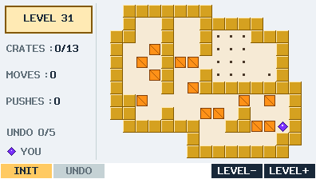 | 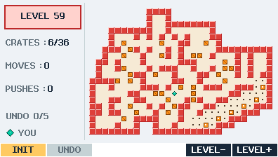 |

<details>
<summary>나머지 그룹의 레벨 선택 화면</summary>

| INTERMEDIATE | ADVANCED |
|---|---|
| 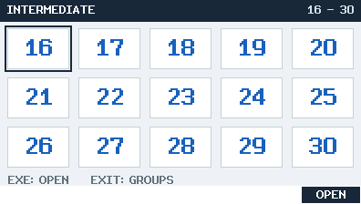 | 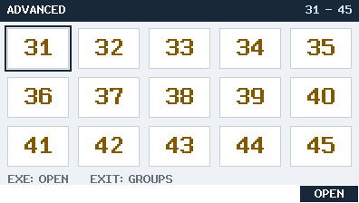 |

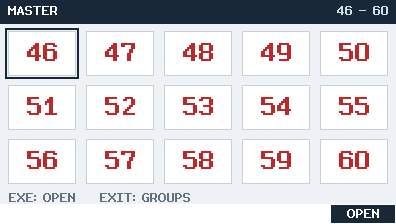

</details>

| 재시작 확인 | 게임 성공 |
|---|---|
| 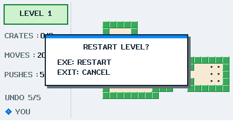 | 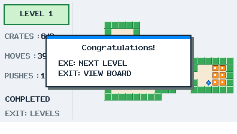 |

성공 창에서 **EXIT를 누르면 완성된 보드를 볼 수 있습니다**. 방향키·INIT·UNDO는
잠기고 INIT·UNDO 버튼은 회색으로 표시됩니다. F5/F6 레벨 이동은 그대로 됩니다.
다시 EXIT를 누르면 레벨 선택으로 나가며, 해당 레벨을 열면 새로 플레이합니다.
획득한 클리어 표시는 유지합니다. 성공 창의 EXE는 다음 레벨로 이동하고,
60번에서는 레벨 선택으로 나갑니다.

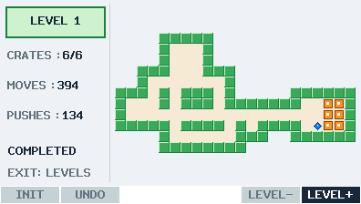

## 로컬 빌드와 설치

[GitHub 베타](https://github.com/omegalpha210/fx-cg50-sokoban/releases/tag/v0.1.0-beta.4)는
**소스 전용**이며 이번에 요청한 README 화면만 포함합니다. 원본 맵의 재배포
허가는 미확인 상태로, 원시·생성 맵 데이터와 맵을 포함한 `.g3a`는 공개하지
않습니다. 선택된 화면의 게시가 맵에 MIT를 적용하거나 원작자의 허가를 새로
확립하는 것은 아닙니다. 자체 코드는 [MIT](LICENSE), 외부 자료는
[별도 고지](THIRD_PARTY_NOTICES.md)를 따릅니다.

기존 fxSDK/gint/SH 컴파일러와 Pillow가 있는 Python 환경을 설정한 뒤 실행합니다.
[개발 환경 안내](docs/DEVELOPMENT.md)

```sh
python3 tools/fetch_maps.py
python3 tools/import_maps.py
bash tools/build.sh
bash tools/test.sh
```

자료는 고정 리비전·크기·SHA-256을 검사하며 일반 빌드는 맵을 내려받거나 갱신하지
않습니다. 로컬 생성된 `dist/SOKOBAN.g3a`를 USB 저장장치 모드로 계산기에 복사하고,
안전하게 연결 해제 후 CASIO MAIN MENU에서 실행합니다. 체크섬은
`dist/SHA256SUMS.txt`에 있습니다. DIFF EQ와 앱·저장 이름은 독립적입니다.

## 조작과 저장

- 메뉴 LEFT/RIGHT: 이전·다음 번호. 행 끝을 연결하고 전체 페이지를 순환합니다.
- 메뉴 UP/DOWN: 같은 열에서 순환합니다. Main 숫자 1~4는 그룹에 바로 진입합니다.
- EXE/F6 OPEN: 선택 항목을 엽니다.
- 플레이 방향키: 이동 또는 상자 한 개 밀기. 완료한 보드에서는 잠깁니다.
- F1 INIT: 재시작 확인. EXE는 실행, EXIT는 취소입니다. 완료한 보드에서는 잠깁니다.
- F2 UNDO: 최근 성공한 이동·밀기 5회까지 복원합니다. 완료한 보드에서는 잠깁니다.
- F5 LEVEL− / F6 LEVEL+: 저장 후 이전·다음 레벨. 1↔60 순환은 없습니다.
- EXIT: 성공 창에서는 보드 보기, 플레이에서는 저장 후 레벨 선택, 레벨 선택에서는 Main입니다.
- MENU: 저장 후 실제 CASIO MAIN MENU로 나갑니다.
- SHIFT+AC/ON: 변경된 진행을 한 번 저장 시도한 뒤 종료합니다. 저장 실패로 종료를 막지 않습니다.

BASIC 1~15 / INTERMEDIATE 16~30 / ADVANCED 31~45 / MASTER 46~60이며 처음부터
모두 선택 가능합니다. 원본의 공식 난이도 구분은 아닙니다. 마름모 플레이어는
9~19픽셀에서 같은 형태를 유지하고, 그룹 색은 재시작 창의 상단 띠에도 적용됩니다.

각 레벨의 위치·카운터·UNDO를 독립 보존합니다. 클리어 표시는 재도전에도 유지합니다.
일반 이동은 RAM을 갱신하며 완료·INIT·EXIT·레벨 이동·MENU·변경 후 OFF에서 저장합니다.
두 슬롯으로 마지막 유효 저장본을 보호합니다. 저장 실패 시 재시도·머무름·저장 없이
이동을 선택하며, OFF 저장 실패는 전원을 켠 뒤 복구 안내를 표시합니다.
강제 전원 차단 직전의 미저장 이동까지 보장하지는 않습니다.
[자세한 사용법](docs/USER_GUIDE.md)

SYSTEM의 Auto Power Off 10/60분, Backlight Duration 30초/1분/3분을 시작과 MENU/ON
복귀 시 읽습니다. 미사용 키·길게 누른 키도 시간을 갱신하며 활동 시 원래 밝기로
복원합니다. OS 설정 자체를 바꾸지 않습니다. [전원 처리](docs/POWER.md)

## 검증

호스트·UBSan 테스트로 규칙, 저장 오류, 키 전환, 절전, 완료 후 잠금과 레벨 이동을
검사합니다. 실제 1번 맵을 풀어 성공 창과 비활성 버튼을 검증하고, 엄격한 SH 빌드와
패키지 검사를 통과한 소스만 공개합니다.

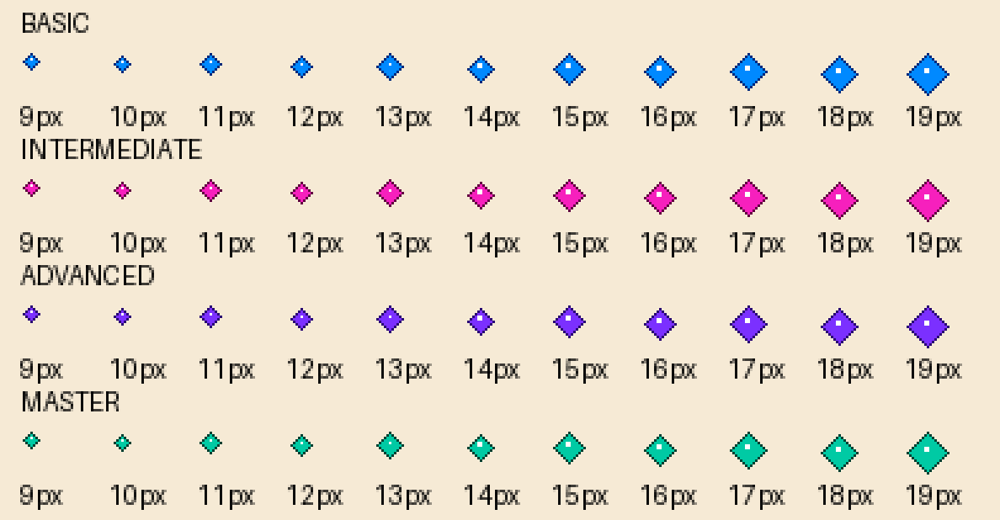

**실제 LCD 색·물리 키·백라이트·OFF/ON 저장 복귀는 실기 재시험이 필요합니다.**
호스트 캡처를 실기 검증으로 간주하지 않습니다.
[검증 결과](docs/ACCEPTANCE.md) · [실기 체크리스트](docs/HARDWARE_RETEST.md) ·
[오류·안정성 상세 검증](docs/STABILITY_KO.md) · [출처](docs/ASSET_PROVENANCE.md)
